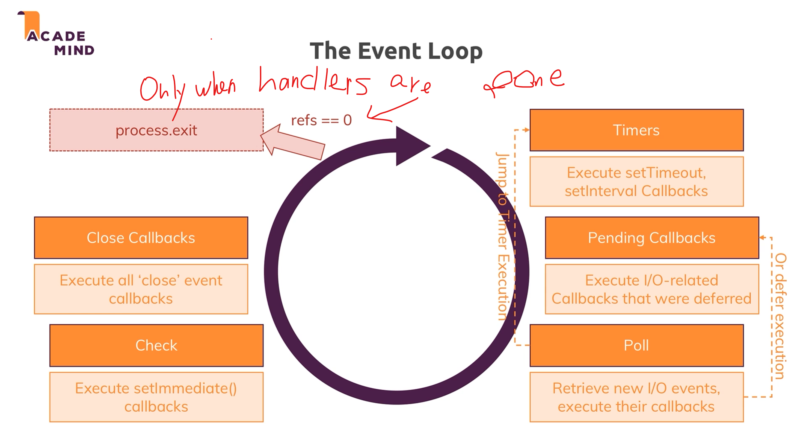

# Node.js Basic
## What is event loop?
## how to get request properties
## how to set response
## how to parse response header?
### Stream vs. Buffer
## Single Thread
### Performance Issue
Event Loop vs Worker Pool: how it help to alleviate performance issue
Poll Phase
what is `setImmediate()`? DIfference between `setTimeOut`?

# Express JS
The order by which Middlewares are added really matter, you want to add middleware 

# Model View Controller
Model: representing your data in your code
View: What the users see: Rendering content
Controller: connection point between your model and view
e.g. how do you process the data and present it into a renderable format
Routes are part of your controller

